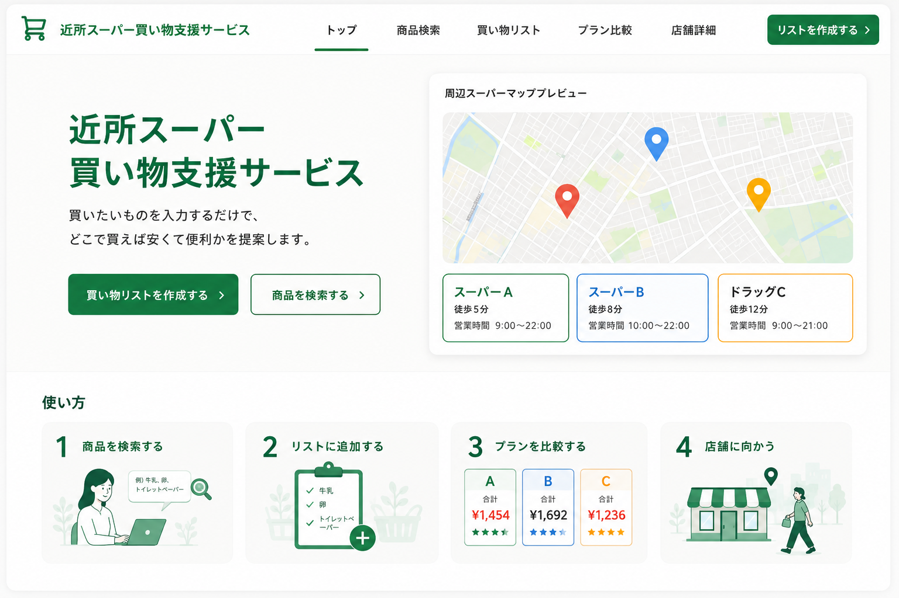
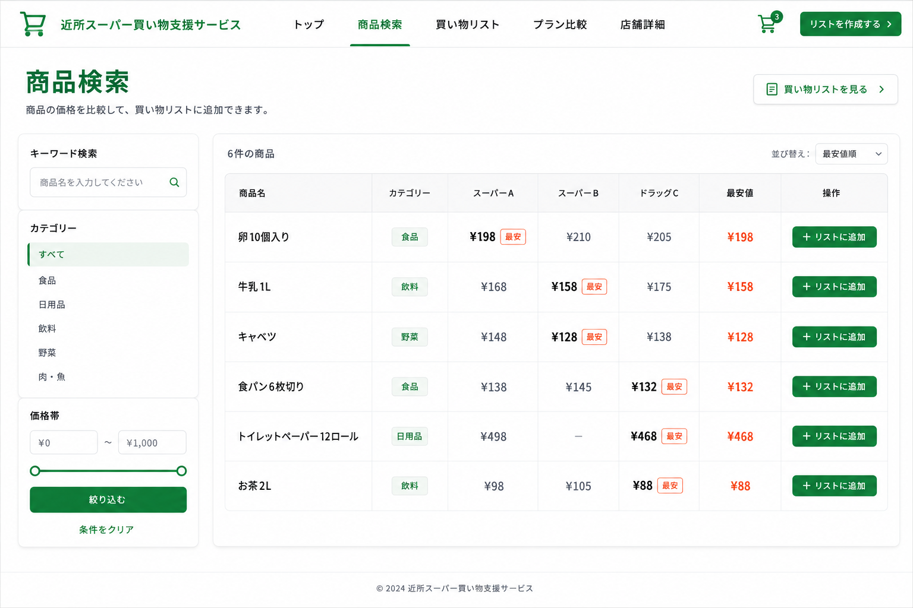
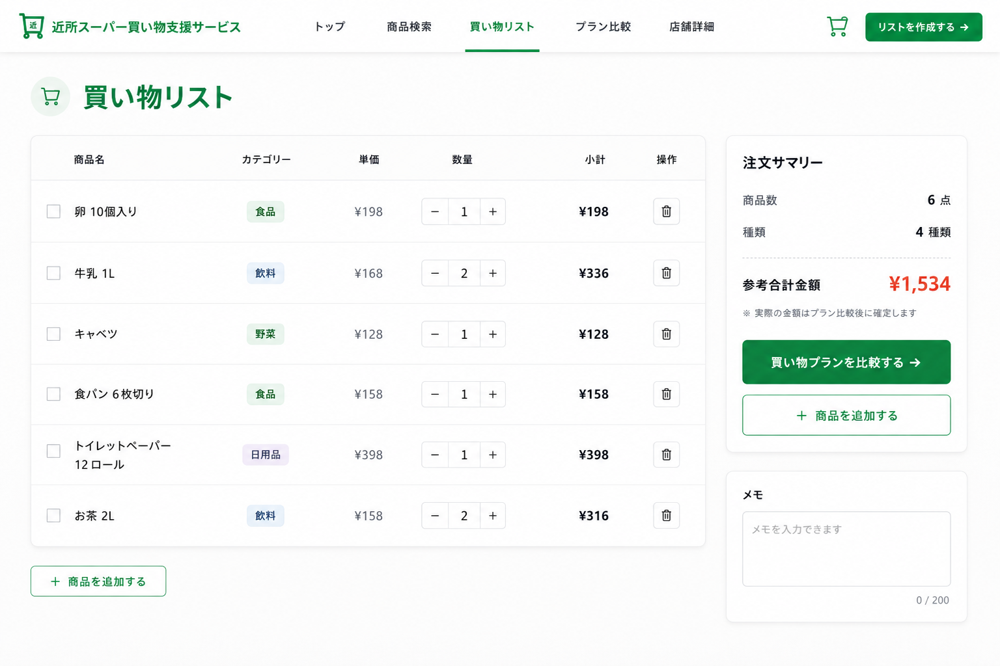
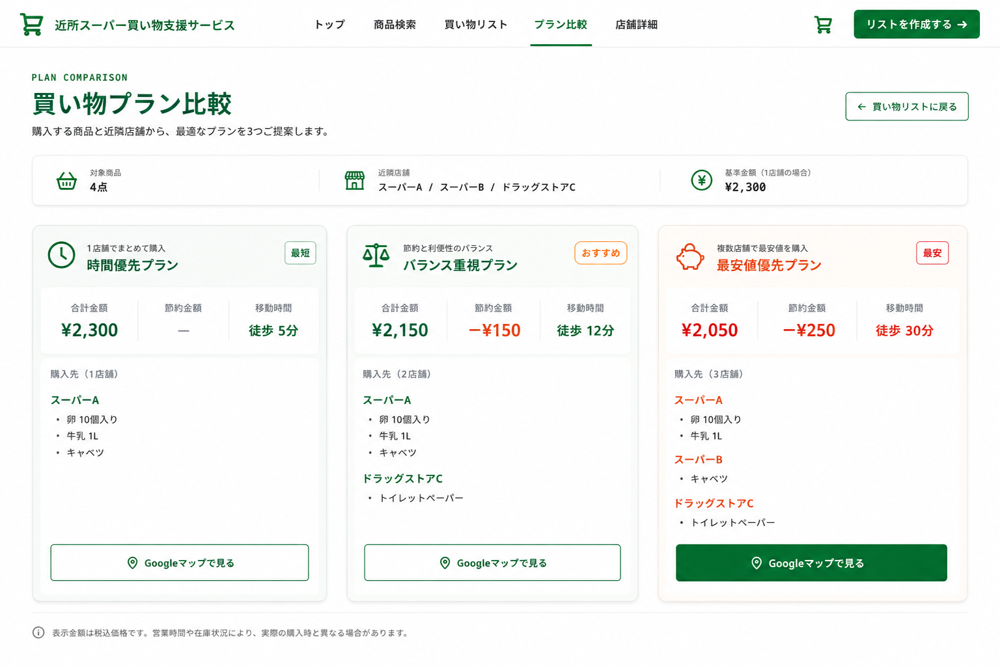
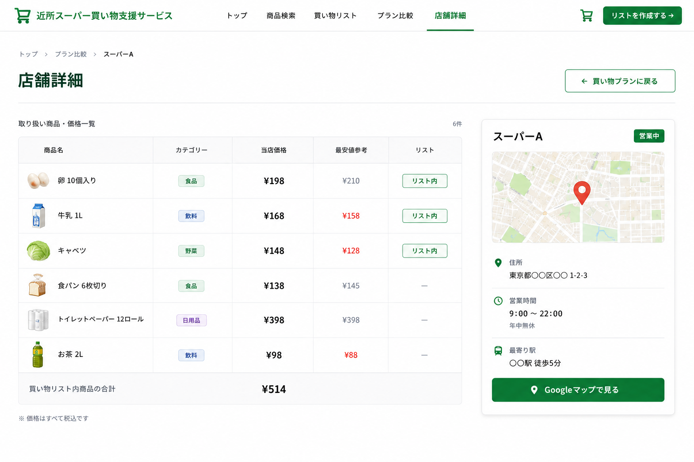

# 近所スーパー買い物支援サービス UIデザイン方針

## 0. 文書情報

| 項目       | 内容                                          |
| ---------- | --------------------------------------------- |
| 文書名     | 近所スーパー買い物支援サービス UIデザイン方針 |
| 作成者     | 柚葉                                          |
| 作成日     | 2026年7月9日                                  |
| 最終更新日 | 2026年7月9日                                  |
| バージョン | 0.1                                           |
| ステータス | 作成中                                        |

---

## 1. UIデザインの目的

本ドキュメントでは、近所スーパー買い物支援サービスのUIデザイン方針を整理する。

本サービスは、ユーザーが商品を検索し、買い物リストを作成し、複数の買い物プランを比較できるWebサービスである。

UIデザインでは、ユーザーが短時間で情報を理解し、自分に合った買い物方法を判断できることを重視する。

---

## 2. デザインコンセプト

本サービスのデザインコンセプトは以下の通りである。

> 日常の買い物前に、価格・節約金額・移動時間を分かりやすく比較できる、安心感のある買い物支援サービス

単に商品価格を表示するだけでなく、ユーザーが「どの店舗で、どのように買えばよいか」を判断しやすいUIを目指す。

---

## 3. UIデザインの方向性

本サービスは、日常生活で利用される買い物支援サービスであるため、以下の印象を重視する。

- 清潔感
- 安心感
- 分かりやすさ
- 実用性
- 信頼感
- 生活に馴染む親しみやすさ

そのため、過度な装飾は避け、白を基調としたシンプルな画面構成とする。

---

## 4. カラー方針

### 4.1 メインカラー

メインカラーにはグリーン系を使用する。

グリーンは、食品、生活、安心感、節約、自然さを連想しやすく、本サービスの「日常の買い物を支援する」という目的に合っている。

### 4.2 カラー利用方針

| 用途           | 色の方針                |
| -------------- | ----------------------- |
| メインカラー   | グリーン系              |
| 背景色         | ホワイト                |
| セクション背景 | ライトグレー            |
| 通常テキスト   | ブラック / ダークグレー |
| 補足テキスト   | グレー                  |
| 価格強調       | レッド / オレンジ系     |
| ボタン         | グリーン系              |
| 枠線           | ライトグレー            |

### 4.3 強調色の使い方

最安値や節約金額など、ユーザーの判断に大きく関わる情報には、レッドまたはオレンジ系の強調色を使用する。

対象例：

- 最安値
- 節約金額
- おすすめプラン
- 重要な価格差

---

## 5. レイアウト方針

本サービスは、MVPではPC向けWebサイトとして設計する。

### 5.1 共通レイアウト

- 画面上部に共通ヘッダーを配置する
- ナビゲーションは全画面で統一する
- メインコンテンツは広めの横幅を活かして配置する
- 情報量が多いページでは、テーブルやカードを活用する
- 重要なCTAボタンは視認性の高い位置に配置する

### 5.2 画面別レイアウト

| 画面                   | レイアウト方針                               |
| ---------------------- | -------------------------------------------- |
| トップページ           | サービス概要とCTAを大きく見せる              |
| 商品検索ページ         | 左に検索条件、右に価格比較テーブルを配置する |
| 買い物リストページ     | 左に商品リスト、右に注文サマリーを配置する   |
| 買い物プラン比較ページ | 3つのプランを横並びで比較しやすく表示する    |
| 店舗詳細ページ         | 左に商品価格表、右に店舗情報カードを配置する |

---

## 6. タイポグラフィ方針

文字情報は、短時間で読み取りやすいことを重視する。

| 用途     | 方針                                         |
| -------- | -------------------------------------------- |
| 大見出し | 太字、大きめのサイズで画面の目的を明確にする |
| 中見出し | セクションごとの内容を分かりやすく示す       |
| 本文     | 読みやすさを重視した標準サイズにする         |
| 補足説明 | グレー系で控えめに表示する                   |
| 価格情報 | 太字、大きめの文字で強調する                 |

---

## 7. コンポーネント方針

本サービスで使用する主なUIコンポーネントは以下の通りである。

| コンポーネント       | 用途                                       |
| -------------------- | ------------------------------------------ |
| ヘッダー             | サービス名、ナビゲーション、CTAを表示する  |
| CTAボタン            | 次の行動へ誘導する                         |
| 検索フォーム         | 商品名検索に使用する                       |
| フィルター           | カテゴリーや価格帯で商品を絞り込む         |
| 商品比較テーブル     | 店舗別価格と最安値を表示する               |
| 買い物リストテーブル | 登録商品、数量、小計を表示する             |
| 注文サマリーカード   | 商品数、種類、参考合計金額を表示する       |
| プランカード         | 複数の買い物プランを比較表示する           |
| 店舗情報カード       | 店舗名、住所、営業時間、地図情報を表示する |
| バッジ               | 最安、おすすめ、営業中などの状態を表示する |

---

## 8. 画面別UIデザイン方針

## 8.1 トップページ

### 目的

サービスの概要を伝え、ユーザーを商品検索または買い物リスト作成へ誘導する。

### UI方針

- サービス名を大きく表示し、何のサービスかすぐ分かるようにする
- メインCTAとして「買い物リストを作成する」を目立たせる
- 右側に地図プレビューを配置し、「近所の店舗をもとに判断するサービス」であることを表現する
- 下部に使い方を4ステップで表示し、利用イメージを分かりやすくする

### 画面イメージ

---

## 8.2 商品検索ページ

### 目的

ユーザーが商品を検索し、店舗別価格を比較しながら買い物リストに追加できるようにする。

### UI方針

- 左側に検索条件をまとめ、右側に商品比較テーブルを配置する
- 店舗別価格を横並びにして比較しやすくする
- 最安値は赤系で強調する
- 「リストに追加」ボタンは各行の右側に配置し、操作しやすくする

### 画面イメージ

---

## 8.3 買い物リストページ

### 目的

ユーザーが追加した商品を確認し、数量変更や削除を行い、買い物プラン比較へ進めるようにする。

### UI方針

- 商品リストをテーブル形式で表示する
- 数量変更は「＋」「−」で直感的に操作できるようにする
- 右側に注文サマリーを配置し、参考合計金額をすぐ確認できるようにする
- 「買い物プランを比較する」ボタンを主要CTAとして強調する

### 画面イメージ

---

## 8.4 買い物プラン比較ページ

### 目的

買い物リスト全体をもとに、複数の買い物方法を比較し、ユーザーが自分に合ったプランを選べるようにする。

### UI方針

この画面は本サービスの中心となる画面である。

以下の3つのプランを横並びで表示する。

- 時間優先プラン
- 最安値優先プラン
- バランス重視プラン

各プランでは、以下の情報を分かりやすく表示する。

- 合計金額
- 節約金額
- 移動時間
- 購入先
- 商品内訳
- Googleマップリンク

価格と移動時間を視覚的に比較しやすくし、ユーザーが短時間で判断できる構成にする。

### 画面イメージ

---

## 8.5 店舗詳細ページ

### 目的

対象店舗の基本情報と、その店舗で購入できる商品の価格情報を確認できるようにする。

### UI方針

- 左側に商品価格一覧を表示する
- 右側に店舗情報カードを配置する
- 営業状況、住所、営業時間、最寄り駅を分かりやすく表示する
- Googleマップへの導線を明確にする
- 買い物リスト内の商品かどうかを分かりやすく表示する

### 画面イメージ

---

## 9. 重要画面

本サービスで最も重要な画面は、買い物プラン比較ページである。

理由は、本サービスの中心価値が「商品価格を見ること」ではなく、「買い物方法を判断すること」にあるためである。

買い物プラン比較ページでは、単純な価格比較だけでなく、以下の要素を同時に比較できるようにする。

- 合計金額
- 節約金額
- 移動時間
- 店舗数
- 購入先

これにより、ユーザーは「安さ」「便利さ」「現実的な移動負担」のバランスを考えながら、自分に合った買い物方法を選択できる。

---

## 10. アクセシビリティ方針

- 文字サイズを小さくしすぎない
- 重要な価格情報は十分なコントラストで表示する
- 色だけで意味を伝えず、ラベルやバッジも併用する
- ボタンはクリックしやすいサイズにする
- テーブルの見出しを明確にする
- 補足情報は読みやすい位置に配置する

---

## 11. レスポンシブ対応方針

MVPではPC向けWebサイトを優先する。

ただし、将来的にはスマートフォンでも利用しやすいレスポンシブ対応を検討する。

想定する対応方針は以下の通りである。

- PCでは横並びレイアウトを使用する
- スマートフォンではカードを縦並びにする
- テーブルは横スクロールまたはカード表示に切り替える
- 買い物プラン比較は、スマートフォンでは1プランずつ縦に表示する

---

## 12. 今後の課題

今後のUIデザイン上の課題は以下の通りである。

- 実際のカラーコードの決定
- フォントサイズの決定
- コンポーネント単位でのデザイン整理
- レスポンシブデザインの検討
- UIデザインと実装の整合性確認
- 実装時のCSS設計
- 店舗側画面、管理者画面のUI設計

---

## 13. まとめ

本サービスのUIデザインでは、ユーザーが買い物前に価格、節約金額、移動時間を短時間で比較し、自分に合った買い物方法を判断できることを重視する。

デザイン全体は、白背景とグリーン系のメインカラーを基調とし、清潔感、安心感、実用性を持つ日本向け生活サービスのUIを目指す。

特に買い物プラン比較ページでは、時間優先、最安値優先、バランス重視の3つのプランを分かりやすく提示し、単なる価格比較ではなく、実際の買い物行動に近い判断支援を行う。

今後は、本UIデザインをもとに、React / Next.js によるMVP実装へ進める。