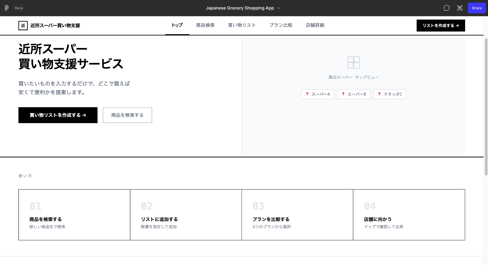
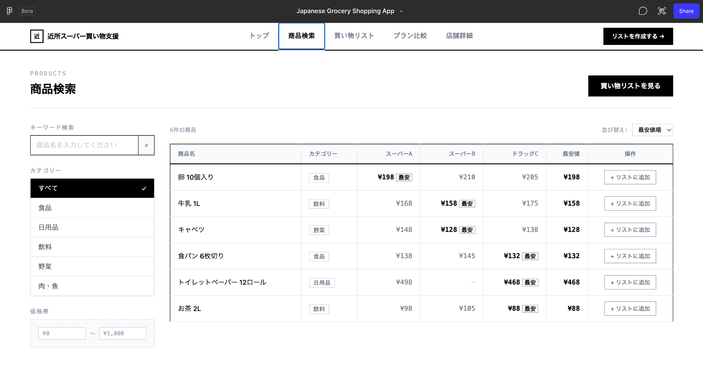
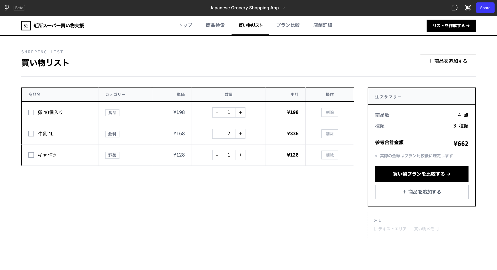
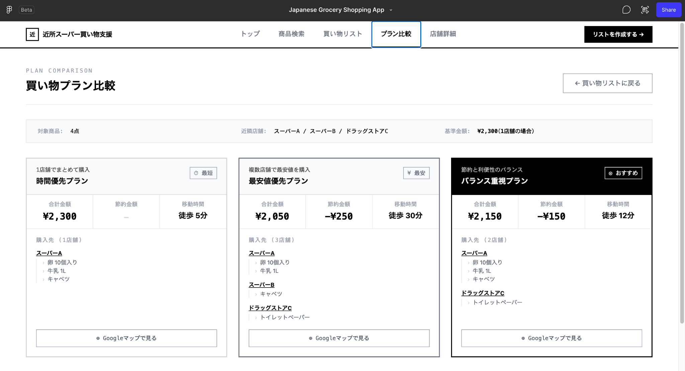
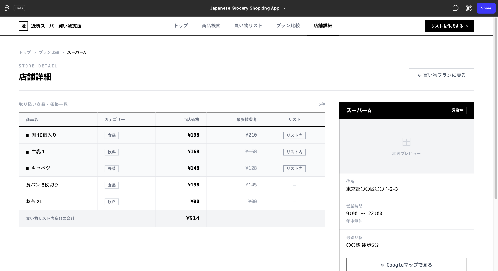

- # 近所スーパー買い物支援サービス ワイヤーフレーム

  ## 0. 文書情報

  | 項目       | 内容                                            |
  | ---------- | ----------------------------------------------- |
  | 文書名     | 近所スーパー買い物支援サービス ワイヤーフレーム |
  | 作成者     | 柚葉                                            |
  | 作成日     | 2026年7月9日                                    |
  | 最終更新日 | 2026年7月9日                                    |
  | バージョン | 0.1                                             |
  | ステータス | 作成中                                          |

  ---

  ## 1. ワイヤーフレームの目的

  本ドキュメントでは、近所スーパー買い物支援サービスのMVPにおける主要画面のワイヤーフレームを整理する。

  第一版では、ユーザー向け機能を中心に設計し、ユーザーが商品を検索し、買い物リストを作成し、複数の買い物プランを比較できる画面構成を検討する。

  本サービスの中心価値は、単にチラシや価格情報を閲覧することではなく、買い物リストをもとに「どこで、どのように買えばよいか」を判断できるようにすることである。

  ---

  ## 2. ワイヤーフレーム確認方法

  本サービスのワイヤーフレームは、Figmaで作成した。

  以下のリンクから確認できる。

  | 項目       | 内容                                                         |
  | ---------- | ------------------------------------------------------------ |
  | 作成ツール | Figma                                                        |
  | 種別       | PC向けWebワイヤーフレーム                                    |
  | バージョン | v0.1                                                         |
  | 確認リンク | [Figmaでワイヤーフレームを見る](https://www.figma.com/make/PpI2ENhwUuzGcUhn8YQoDA/Japanese-Grocery-Shopping-App?p=f&t=q78DxFp2wxw3uUOl-0&fullscreen=1) |

  ---

  ## 3. ワイヤーフレーム画像

  ワイヤーフレーム画像は、以下のパスに保存する。

      docs/assets/wireframe-top.png
      docs/assets/wireframe-search.png
      docs/assets/wireframe-list.png
      docs/assets/wireframe-plan.png
      docs/assets/wireframe-store.png

  ---

  ## 4. デザイン方針

  MVPでは、まずPC向けWebサイトとして画面を設計する。

  画面は低保真ワイヤーフレームとして作成し、配色や装飾よりも、情報構造、導線、機能配置を優先する。

  ### 4.1 基本方針

  - PC向けWebサイトとして設計する
  - 黒・白・グレーを中心とした低保真デザインにする
  - ユーザーが迷わず操作できる導線を重視する
  - 商品検索から買い物プラン比較までの流れを分かりやすくする
  - MVPではユーザー向け画面を中心に設計する

  ---

  ## 5. 対象画面

  MVPで作成する主要画面は以下の通りである。

  | 画面名                 | 目的                                                         |
  | ---------------------- | ------------------------------------------------------------ |
  | トップページ           | サービス概要を伝え、商品検索や買い物リスト作成へ誘導する     |
  | 商品検索ページ         | 商品を検索し、価格を比較しながら買い物リストに追加する       |
  | 買い物リストページ     | 登録した商品、数量、参考合計金額を確認・編集する             |
  | 買い物プラン比較ページ | 時間優先、最安値優先、バランス重視の3つの買い物プランを比較する |
  | 店舗詳細ページ         | 店舗情報、営業時間、取扱商品の価格を確認する                 |

  ---

  ## 6. 共通ナビゲーション

  全画面共通で、画面上部にヘッダーナビゲーションを配置する。

  ### 6.1 ヘッダー項目

  | 項目             | 内容                             |
  | ---------------- | -------------------------------- |
  | ロゴ             | サービスロゴ・サービス名         |
  | トップ           | トップページへ遷移する           |
  | 商品検索         | 商品検索ページへ遷移する         |
  | 買い物リスト     | 買い物リストページへ遷移する     |
  | プラン比較       | 買い物プラン比較ページへ遷移する |
  | 店舗詳細         | 店舗詳細ページへ遷移する         |
  | リストを作成する | 買い物リスト作成への主要CTA      |

  ---

  ## 7. 画面遷移イメージ

  想定する基本的な利用フローは以下の通りである。

      トップページ
        ↓
      商品検索ページ
        ↓
      買い物リストページ
        ↓
      買い物プラン比較ページ
        ↓
      店舗詳細ページ / Googleマップ確認

  ユーザーは、商品検索ページで商品を探し、買い物リストに追加する。

  その後、買い物リストページで商品や数量を確認し、買い物プラン比較ページで複数の買い物方法を比較する。

  ---

  ## 8. トップページ

  ### 8.1 画面イメージ

  

  ### 8.2 目的

  トップページでは、サービスの概要を伝え、ユーザーを商品検索または買い物リスト作成へ誘導する。

  ### 8.3 主な構成要素

  | 要素             | 内容                                                         |
  | ---------------- | ------------------------------------------------------------ |
  | サービス名       | 近所スーパー買い物支援サービス                               |
  | キャッチコピー   | 買いたいものを入力するだけで、どこで買えば安くて便利かを提案する |
  | メインCTA        | 買い物リストを作成する                                       |
  | サブCTA          | 商品を検索する                                               |
  | マッププレビュー | 周辺スーパーの位置情報を示す仮の地図エリア                   |
  | 使い方           | 商品検索、リスト追加、プラン比較、店舗へ向かう流れを示す     |

  ### 8.4 評価ポイント

  トップページでは、サービスの目的が一目で分かる構成になっている。

  左側にサービス説明とCTA、右側に周辺マッププレビューを配置することで、「近所の店舗をもとに買い物を支援するサービス」であることが伝わりやすい。

  ---

  ## 9. 商品検索ページ

  ### 9.1 画面イメージ

  

  ### 9.2 目的

  商品検索ページでは、ユーザーが購入したい商品を検索し、各店舗の価格を比較しながら買い物リストに追加できるようにする。

  ### 9.3 主な構成要素

  | 要素                 | 内容                                                   |
  | -------------------- | ------------------------------------------------------ |
  | キーワード検索       | 商品名を入力して検索する                               |
  | カテゴリーフィルター | 食品、日用品、飲料、野菜、肉・魚などで絞り込む         |
  | 価格帯フィルター     | 価格範囲を指定して絞り込む                             |
  | 商品一覧テーブル     | 商品名、カテゴリー、店舗別価格、最安値、操作を表示する |
  | 最安値表示           | 店舗別価格の中で最も安い価格を明示する                 |
  | リスト追加ボタン     | 商品を買い物リストへ追加する                           |

  ### 9.4 表示項目

  | 項目                | 内容                         |
  | ------------------- | ---------------------------- |
  | 商品名              | 卵、牛乳、キャベツなど       |
  | カテゴリー          | 食品、飲料、野菜、日用品など |
  | スーパーA価格       | スーパーAでの価格            |
  | スーパーB価格       | スーパーBでの価格            |
  | ドラッグストアC価格 | ドラッグストアCでの価格      |
  | 最安値              | 各店舗の中で最も安い価格     |
  | 操作                | 買い物リストに追加するボタン |

  ### 9.5 評価ポイント

  商品検索ページでは、単に商品を検索するだけでなく、店舗別の価格比較が一覧で確認できる。

  ユーザーは商品ごとの最安値を確認しながら、買い物リストに追加できるため、買い物判断の前段階として分かりやすい画面になっている。

  ---

  ## 10. 買い物リストページ

  ### 10.1 画面イメージ

  

  ### 10.2 目的

  買い物リストページでは、ユーザーが追加した商品を確認し、数量変更や削除を行った上で、買い物プラン比較へ進めるようにする。

  ### 10.3 主な構成要素

  | 要素             | 内容                                 |
  | ---------------- | ------------------------------------ |
  | 買い物リスト一覧 | 登録済みの商品を一覧表示する         |
  | 数量変更         | 商品ごとに数量を増減できる           |
  | 削除ボタン       | 不要な商品をリストから削除する       |
  | 注文サマリー     | 商品数、種類、参考合計金額を表示する |
  | メモ欄           | 買い物メモを入力できる               |
  | プラン比較ボタン | 買い物プラン比較ページへ遷移する     |

  ### 10.4 表示項目

  | 項目       | 内容                         |
  | ---------- | ---------------------------- |
  | 商品名     | 買い物リストに追加された商品 |
  | カテゴリー | 商品カテゴリー               |
  | 単価       | 参考価格                     |
  | 数量       | 購入予定数量                 |
  | 小計       | 単価と数量をもとにした小計   |
  | 操作       | 削除ボタン                   |

  ### 10.5 評価ポイント

  買い物リストページでは、ユーザーが購入予定の商品を整理できる。

  右側に注文サマリーを配置することで、現在のリスト内容や参考合計金額をすぐ確認できる。

  また、主要ボタンとして「買い物プランを比較する」を配置することで、次の行動が明確になっている。

  ---

  ## 11. 買い物プラン比較ページ

  ### 11.1 画面イメージ

  

  ### 11.2 目的

  買い物プラン比較ページでは、買い物リスト全体をもとに、複数の購入パターンを比較し、ユーザーが自分に合った買い物方法を判断できるようにする。

  ### 11.3 主な構成要素

  | 要素               | 内容                                               |
  | ------------------ | -------------------------------------------------- |
  | 対象商品数         | 買い物リスト内の商品数を表示する                   |
  | 近隣店舗           | 比較対象となる店舗を表示する                       |
  | 基準金額           | 一店舗で購入した場合などの基準金額を表示する       |
  | 時間優先プラン     | 移動時間を短くする買い物方法を表示する             |
  | 最安値優先プラン   | 合計金額を最も安くする買い物方法を表示する         |
  | バランス重視プラン | 価格と移動時間のバランスを取る買い物方法を表示する |
  | Googleマップボタン | 各プランのルート確認へ誘導する                     |

  ### 11.4 プラン比較項目

  | 項目         | 内容                             |
  | ------------ | -------------------------------- |
  | 合計金額     | 各プランで購入した場合の合計金額 |
  | 節約金額     | 基準金額との差額                 |
  | 移動時間     | 想定される徒歩時間               |
  | 購入先       | 商品ごとの購入店舗               |
  | おすすめ表示 | 推奨プランを明示する             |

  ### 11.5 各プランの役割

  | プラン             | 役割                                       |
  | ------------------ | ------------------------------------------ |
  | 時間優先プラン     | 一店舗でまとめて購入し、移動時間を短くする |
  | 最安値優先プラン   | 複数店舗を回り、合計金額を最も安くする     |
  | バランス重視プラン | 節約金額と移動時間のバランスを取る         |

  ### 11.6 評価ポイント

  買い物プラン比較ページは、本サービスの中心となる画面である。

  既存のチラシ閲覧サービスとの差別化として、単なる価格表示ではなく、買い物リスト全体をもとに複数の買い物方法を提案している。

  ユーザーは価格、移動時間、店舗数を比較しながら、自分に合った買い物方法を選択できる。

  ---

  ## 12. 店舗詳細ページ

  ### 12.1 画面イメージ

  

  ### 12.2 目的

  店舗詳細ページでは、対象店舗の基本情報と、その店舗で購入できる商品の価格情報を確認できるようにする。

  ### 12.3 主な構成要素

  | 要素               | 内容                             |
  | ------------------ | -------------------------------- |
  | 店舗名             | スーパーAなどの店舗名            |
  | 営業状況           | 営業中などのステータス           |
  | 地図プレビュー     | 店舗位置を示す仮の地図エリア     |
  | 住所               | 店舗住所                         |
  | 営業時間           | 店舗の営業時間                   |
  | 最寄り駅           | 店舗へのアクセス情報             |
  | 商品価格一覧       | その店舗で取り扱う商品の価格     |
  | Googleマップボタン | 外部地図サービスで店舗を確認する |

  ### 12.4 表示項目

  | 項目       | 内容                               |
  | ---------- | ---------------------------------- |
  | 商品名     | 店舗で取り扱う商品                 |
  | カテゴリー | 商品カテゴリー                     |
  | 当店価格   | 対象店舗での価格                   |
  | 最安値参考 | 他店舗を含めた最安値参考           |
  | リスト状態 | 買い物リストに含まれているかどうか |

  ### 12.5 評価ポイント

  店舗詳細ページでは、店舗情報と商品価格を同時に確認できる。

  買い物プラン比較ページから遷移することで、ユーザーは選択したプラン内の店舗情報を詳しく確認できる。

  ---

  ## 13. MVPで優先する画面

  MVPでは、以下の画面を優先して実装する。

  1. 商品検索ページ
  2. 買い物リストページ
  3. 買い物プラン比較ページ

  特に、買い物プラン比較ページは本サービスの中心価値を示す画面であるため、最優先で設計・実装する。

  トップページと店舗詳細ページは、サービス全体の理解や補足情報の表示に必要な画面として扱う。

  ---

  ## 14. 今後追加する画面

  将来的には、以下の画面を追加する予定である。

  - 店舗側価格登録画面
  - 管理者画面
  - ユーザー登録画面
  - お気に入り店舗画面
  - よく買う商品一覧画面
  - 通知設定画面
  - 店舗向け分析画面

  ---

  ## 15. まとめ

  本ワイヤーフレームでは、近所スーパー買い物支援サービスのMVPにおけるユーザー向け主要画面を整理した。

  本サービスでは、商品検索、買い物リスト作成、買い物プラン比較という流れを通じて、ユーザーが買い物前に価格や移動時間を比較し、自分に合った買い物方法を判断できるようにする。

  特に、買い物プラン比較ページでは、時間優先、最安値優先、バランス重視の3つのプランを提示することで、単なる価格比較ではなく、実際の買い物行動に近い判断支援を行う。

  今後は、本ワイヤーフレームをもとに画面設計をさらに具体化し、MVP実装へ進める。